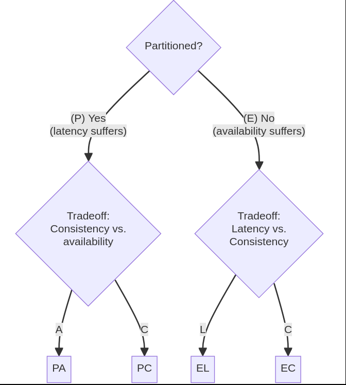

```bash
# latest RabbitMQ 4.0.x
docker run -it --rm --name rabbitmq -p 5672:5672 -p 15672:15672 rabbitmq:4.0-management
```


## Anwendungsfälle
### Publish/Subscribe
Anwendungsfall:
Ein Nachrichtensystem für Warnmeldungen, bei dem mehrere Dienste (z. B. SMS, E-Mail, Dashboard) dieselbe Nachricht empfangen.

### Request/Response
Anwendungsfall:
Ein Microservice-basierter Zahlungsdienst, bei dem ein Frontend eine Zahlungsanfrage sendet und eine Bestätigung oder Ablehnung zurückerhält.


# NR2) Exchange-Typen und deren Nutzung von Routing-Keys

## 1. Direct Exchange
**Beschreibung:**  
Der Direct Exchange leitet Nachrichten basierend auf einer exakten Übereinstimmung zwischen dem Routing-Key der Nachricht und dem Routing-Key der Queue weiter.

**Verwendung:**  
- Jede Queue, die an den Exchange gebunden ist, gibt einen spezifischen Routing-Key an.  
- Nur Nachrichten mit genau diesem Routing-Key werden an die Queue zugestellt.

**Anwendungsbeispiel:**  
Ein Log-System, bei dem Nachrichten nach Log-Level gefiltert werden:
- `error` → Nachrichten mit Fehlern gehen in die `error-queue`.
- `info` → Informationsnachrichten gehen in die `info-queue`.

---

## 2. Topic Exchange
**Beschreibung:**  
Der Topic Exchange ermöglicht eine flexiblere Filterung, indem Platzhalter (`*` und `#`) im Routing-Key verwendet werden:
- `*` steht für genau ein Wort.  
- `#` steht für null oder mehr Wörter.  

**Verwendung:**  
- Queues können an den Exchange mit Routing-Key-Mustern gebunden werden.  
- Nachrichten mit Routing-Keys, die mit dem Muster übereinstimmen, werden zugestellt.

**Anwendungsbeispiel:**  
Ein Benachrichtigungssystem für einen E-Commerce-Shop:
- Routing-Key `order.*` → Zustellung an eine Queue, die alle Bestellstatus bearbeitet.  
- Routing-Key `order.completed` → Zustellung an eine Queue, die nur abgeschlossene Bestellungen bearbeitet.  
- Routing-Key `shipment.#` → Zustellung an eine Queue, die alle Versandereignisse bearbeitet.  

---

## Konkretes Beispiel für die Nutzung von Routing-Keys

**Anwendung:**  
Ein Echtzeit-Benachrichtigungssystem für ein IoT-Netzwerk.

**Szenario:**  
Ein Smart-Home-System sendet Sensor-Daten (Temperatur, Bewegung, Rauch) an verschiedene Queues.

### Direct Exchange:
- Routing-Key `temperature` → Temperaturdaten gehen in die `temperature-queue`.  
- Routing-Key `motion` → Bewegungsdaten gehen in die `motion-queue`.  

### Topic Exchange:
- Routing-Key `sensor.kitchen.*` → Alle Sensordaten aus der Küche werden in die `kitchen-queue` zugestellt.  
- Routing-Key `sensor.#` → Alle Sensordaten aus allen Räumen gehen in die `all-sensors-queue`.  

---

## Vorteile von Routing-Keys
- **Gezielte Nachrichtenverteilung:** Nachrichten werden nur an die relevanten Queues zugestellt, was die Effizienz erhöht.  
- **Flexibilität:** Mit Topic Exchanges können komplexe Filterlogiken umgesetzt werden.  
- **Skalierbarkeit:** Routing-Keys ermöglichen es, Nachrichtenströme dynamisch zu steuern und zu verteilen.


# NR3)

# Das PACELC-Theorem

Das **PACELC-Theorem** wird hauptsächlich verwendet, um die Designentscheidungen und Kompromisse bei verteilten Datenbanken und Systemen zu analysieren. Es erweitert das bekannte **CAP-Theorem** und berücksichtigt nicht nur die Kompromisse zwischen Konsistenz und Verfügbarkeit während eines Partitionierungsereignisses (wie beim CAP-Theorem), sondern auch die Kompromisse zwischen Latenz und Konsistenz in Abwesenheit von Partitionierungen.

## Hauptziele
- Entwicklern und Architekten helfen, die geeignete Datenbank oder das System für spezifische Anforderungen auszuwählen.
- Auswirkungen von Konsistenz, Verfügbarkeit und Latenz auf verteilte Systeme aufzeigen.

---

## Typische Einsatzgebiete

1. **Datenbanken**
   - Systeme wie **DynamoDB**, **Cassandra** oder **MongoDB** sind prominente Beispiele.  
   - Diese Datenbanken nutzen das PACELC-Modell, um zwischen Konsistenz, Verfügbarkeit und Latenz zu balancieren.

2. **Content Delivery Networks (CDNs)**
   - CDNs verwenden das PACELC-Modell, um Daten weltweit effizient zu verteilen.
   - Ziel: Inhalte so bereitzustellen, dass Benutzer weltweit eine niedrige Latenz und hohe Verfügbarkeit erleben.

3. **Cloud-Dienste**
   - Skalierbare und hochverfügbare Anwendungen in der Cloud setzen auf PACELC-Prinzipien, um Nutzern zuverlässige und schnelle Dienste anzubieten.
   - Beispiele: Cloud-basierte Datenspeicherung oder Analyseplattformen.

---

## Bedeutung
Das PACELC-Theorem bietet eine umfassendere Sichtweise auf die Herausforderungen und Kompromisse in verteilten Systemen und ermöglicht fundiertere Entscheidungen bei der Architektur solcher Systeme.



- PA/EL - prioritize availability and latency over consistency
- PA/EC - when there is a partition, choose availability; else, choose consistency
- PC/EL - when there is a partition, choose consistency; else, choose latency
- PC/EC - choose consistency at all times


# NR4) Choreografie vs. Orchestration
### Choreografie
- **Dezentrale Steuerung:** Services kommunizieren über Events, keine zentrale Instanz.
- **Hohe Skalierbarkeit:** Ideal für lose gekoppelte, unabhängige Services.
- **Komplexe Fehlerbehandlung:** Jeder Service muss Kompensation selbst verwalten.

### Orchestration
- **Zentrale Steuerung:** Ein Orchestrator koordiniert alle Schritte.
- **Einfachere Fehlerbehandlung:** Fehler und Kompensation werden zentral verwaltet.
- **Begrenzte Skalierbarkeit:** Orchestrator kann zum Engpass werden.


| **Kriterium**            | **Choreografie**                         | **Orchestration**                     |
|--------------------------|------------------------------------------|---------------------------------------|
| **Steuerung**             | Dezentral (durch Events)                | Zentral (durch Orchestrator)         |
| **Komplexität**           | Verteilung der Logik auf viele Services  | Komplexität im Orchestrator          |
| **Kopplung**              | Lose Kopplung                           | Enge Kopplung                        |
| **Fehlerbehandlung**      | Komplex und verteilt                    | Zentralisiert                        |
| **Skalierbarkeit**        | Sehr hoch                               | Begrenzt durch den Orchestrator      |
| **Nachverfolgbarkeit**    | Schwierig                                | Einfach                              |
| **Beispiele**             | Event-basierte Systeme (z. B. Kafka)    | BPM-Tools (z. B. Camunda, Temporal)  |


# Nr5)
| **Architektur**          | **Monolith**                           | **Modularer Monolith**                  | **Microservices**                     |
|--------------------------|----------------------------------------|-----------------------------------------|---------------------------------------|
| **Teamgröße**             | Kleinere Teams                         | Mittlere Teams                          | Große Teams                           |
| **Technische Anforderungen** | Einfache technische Anforderungen     | Teilweise unabhängige Module            | Hohe, komplexe technische Anforderungen |
| **Skalierbarkeit**        | Geringe Skalierbarkeit notwendig       | Moderate Skalierbarkeit                 | Hohe Skalierbarkeit gefordert         |
| **Modularität**           | Keine Modularität oder stark gekoppelt | Teilweise unabhängige Module            | Hohe Modularität, lose Kopplung       |
| **Beispiel**              | Blog-Website                           | ERP-System                              | E-Commerce-Plattform                  |


